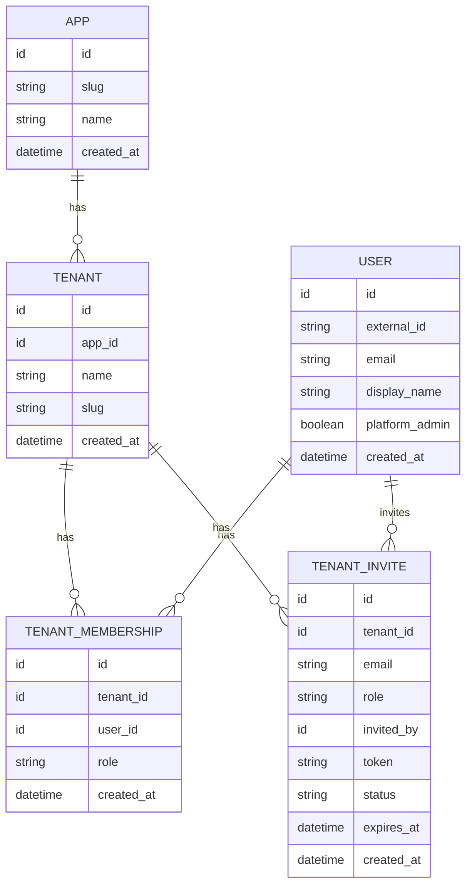

# Data Model (ER)

Entity-relationship twin of the [Data Model](../architecture/sisques-account/data-model.md)
schema.

`tenant.slug` is unique per app (`UNIQUE(app_id, slug)`), not global.
`tenant_membership` is unique per `(tenant_id, user_id)`.
