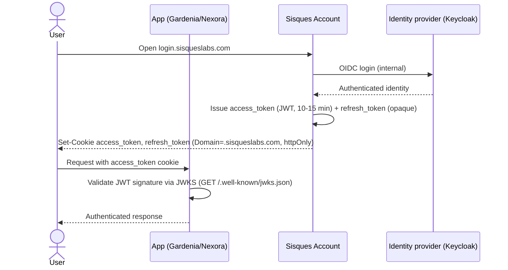

# Login & Token Issuance

The login flow from a user opening Sisques Account to an app receiving a
validated `access_token`.

SPA apps that cannot read an `httpOnly` cookie instead call
`GET login.sisqueslabs.com/api/token` (`credentials: include`) to obtain the
JWT in the response body, and send it as `Authorization: Bearer` to their
own API. See [Sessions & Tokens](../architecture/sisques-account/sessions-and-tokens.md)
for the full reasoning.
