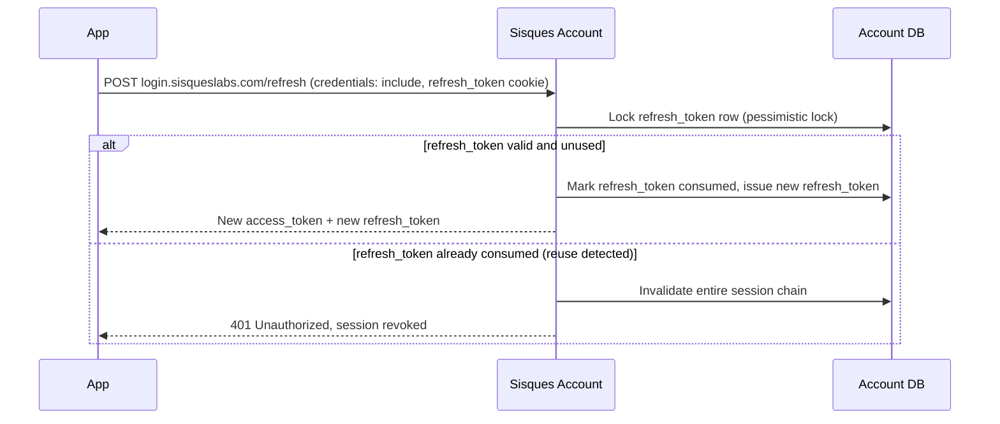

# Refresh Rotation

Refresh-token rotation with reuse detection, reusing the pattern already
proven in production in `gardenia-api`.

Reusing an already-consumed `refresh_token` invalidates the whole session
chain — a signal of token theft. See
[Sessions & Tokens](../architecture/sisques-account/sessions-and-tokens.md)
and [ADR-0006](../adr/0006-refresh-rotation-reuse-detection.md) (refresh
rotation with reuse detection).
