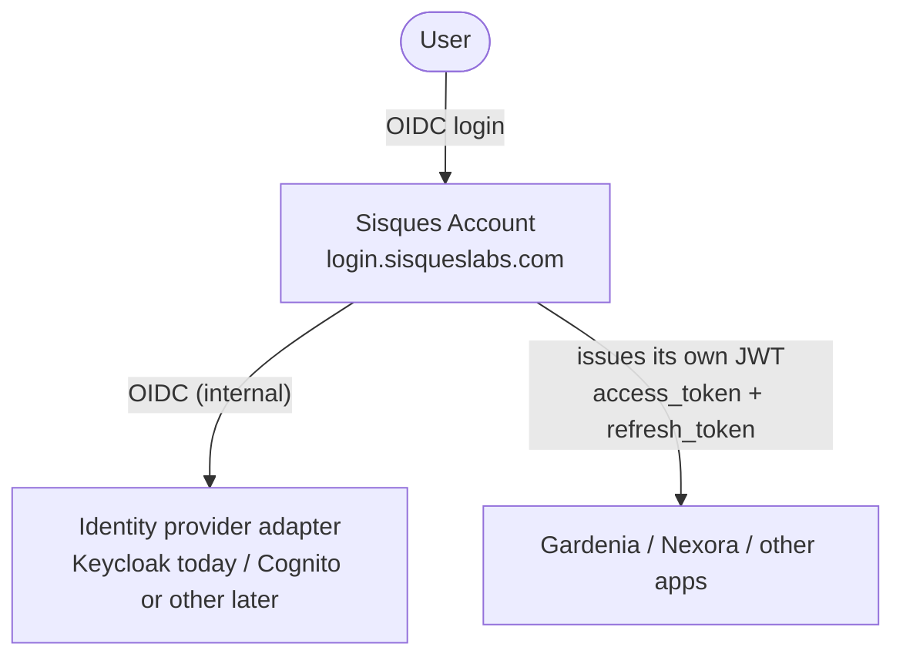

# System Context

How users, Sisques Account, the identity provider, and apps relate to each
other. Apps never talk to the identity provider directly — only to Sisques
Account, which issues its own signed tokens.

See [Sisques Account overview](../architecture/sisques-account/index.md) for
the reasoning behind this shape, and
[ADR-0001](../adr/0001-sisques-account-owns-identity.md) (Sisques Account
owns identity) and [ADR-0003](../adr/0003-idp-behind-swappable-adapter.md)
(IdP behind a swappable adapter) for the locked decisions.
